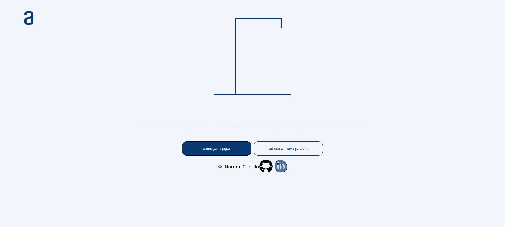

# Jogo da Forca

O jogo da forca é um jogo para adivinhar as letras que compõem uma palavra secreta.

Durante o jogo, assim que a letra é adivinhada, ela vai substituir o traçinho pela letra adivinhada.

Por cada letra não adivinhada, vão se desenhar uma parte do homecinho (man) até completa-lo e forca-lo. Aparecerão o alert: Você perdeu!". Mas se adivinhar a palavra antes do desenho do homecinho ficar completo, vai aparecer o alert: "Você venceu!".
 

#**Requisitos:**
- Deve funcionar só com letras maiúsculas;
- Não devem ser utilizadas letras com acentos nem caracteres especiais;
- Ao completar o desenho da forca, deve ser exibida uma mensagem na tela de "Fim de Jogo";
- Se completar a palavra correta antes de acabarem as tentativas, deve ser exibida na tela a mensagem "Você Venceu. Parabéns!";
- A página deve ter os traços indicando cada letra da palavra, separados por espaço;
- A página deve ter um botão de "Iniciar Jogo" para começar o jogo;
- Só deve ser possívél escrever letras (os números não serão válidos)
- As letras erradas devem aparecer na tela, mas não podem aparecer repetidamente;
- As letras corretas devem ser mostradas na tela acima dos traços, nas posições corretas em relação à palavra.

  
 

 

  

### lenguajes:

  

  
  
  
